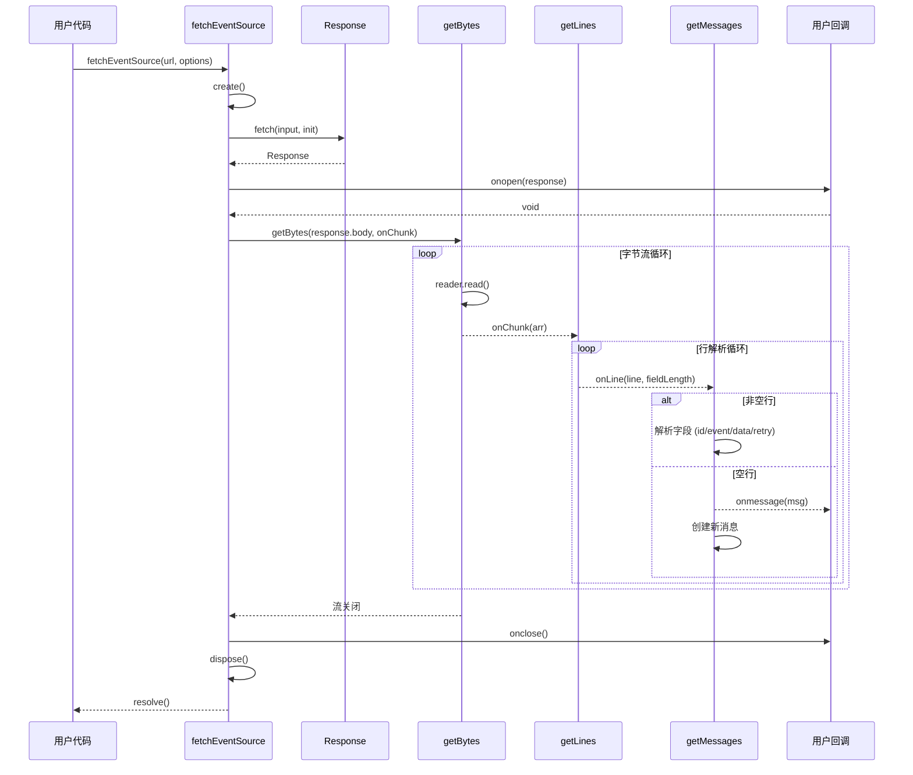
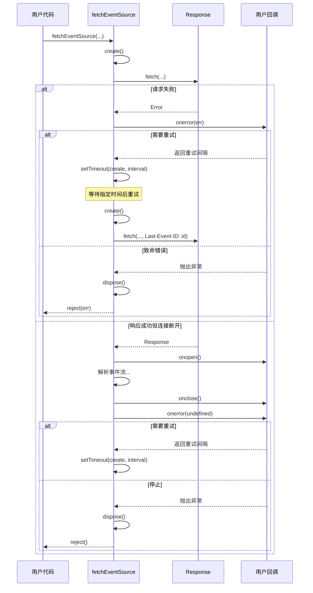
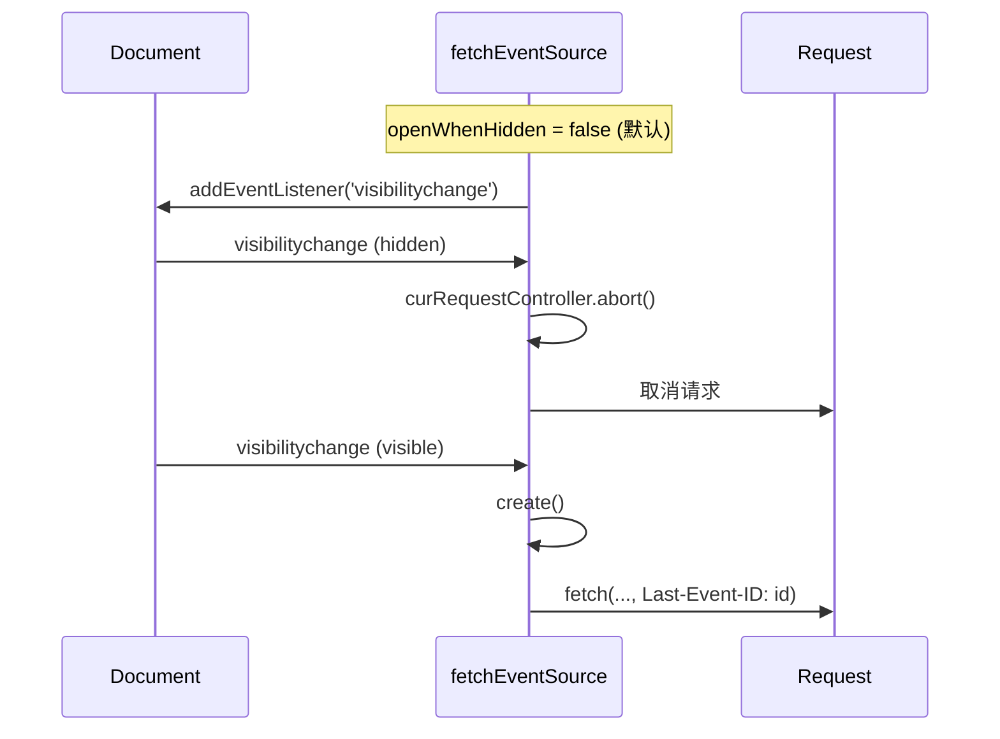

# fetch-event-source 源码解读

## 第一部分: 业务价值篇

### 项目定位

**`@microsoft/fetch-event-source`** 是微软开源的一个基于 Fetch API 的 Server-Sent Events (SSE) 客户端库,为浏览器提供了更强大、更灵活的服务器推送事件接收能力。

### 解决的核心痛点

原生浏览器的 `EventSource` API 存在以下限制:
| 限制 | 说明 |
|------|------|
| **仅支持 GET 请求** | 无法使用 POST、PUT 等其他 HTTP 方法 |
| **无法自定义请求头** | 无法传递认证令牌、内容类型等自定义头部 |
| **无法发送请求体** | 所有参数必须编码在 URL 中,受限于浏览器 URL 长度限制(通常 2000 字符) |
| **重试策略不可控** | 连接断开时浏览器自动重试但无法自定义重试逻辑 |
| **错误处理能力有限** | 无法优雅处理 API 网关返回的错误响应 |

### 技术亮点

| 技术亮点 | 说明 |
|----------|------|
| **基于 Fetch API** | 充分利用 Fetch API 的所有特性(自定义方法、头部、请求体等) |
| **完全兼容 SSE 格式** | 与标准 Event Stream 格式 100% 兼容 |
| **灵活的重试策略** | 完全掌控连接断开时的重试逻辑 |
| **页面可见性集成** | 自动在页面隐藏时断开连接、显示时重连,减少服务器负载 |
| **可替换的 fetch 实现** | 支持注入自定义 fetch 函数 |
| **TypeScript 原生支持** | 完整的类型定义 |

### 适用场景

| 场景 | 说明 |
|------|------|
| **实时数据推送** | 股票行情、实时新闻、即时消息 |
| **进度更新** | 长时间运行任务的进度追踪 |
| **日志流** | 实时日志查看和监控 |
| **协作应用** | 多人协作时的实时状态同步 |
| **AI 应用** | 大语言模型的流式响应输出 |

### 典型使用 Case

#### Case 1: 基础 SSE 连接

```typescript
import { fetchEventSource } from '@microsoft/fetch-event-source';

await fetchEventSource('/api/sse', {
    onmessage(ev) {
        console.log(ev.data);
    }
});
```

#### Case 2: 带认证和自定义请求

```typescript
const ctrl = new AbortController();
fetchEventSource('/api/sse', {
    method: 'POST',
    headers: {
        'Content-Type': 'application/json',
        'Authorization': 'Bearer token123'
    },
    body: JSON.stringify({ query: 'data' }),
    signal: ctrl.signal,
    onmessage(msg) {
        // 处理消息
    }
});
```

#### Case 3: 自定义错误处理和重试

```typescript
class RetriableError extends Error { }
class FatalError extends Error { }

fetchEventSource('/api/sse', {
    async onopen(response) {
        if (response.ok && response.headers.get('content-type') === 'text/event-stream') {
            return;
        } else if (response.status >= 400 && response.status < 500 && response.status !== 429) {
            throw new FatalError();
        } else {
            throw new RetriableError();
        }
    },
    onerror(err) {
        if (err instanceof FatalError) {
            throw err; // 停止操作
        }
        // 返回重试间隔(毫秒),undefined 使用默认 1 秒
        return 2000;
    }
});
```

### 技术栈分析

| 技术 | 版本 | 用途 |
|------|------|------|
| TypeScript | ^4.2.4 | 开发语言 |
| Jasmine | ^4.3.1 | 测试框架 |
| ES2017 | - | 目标 ECMAScript 版本 |

#### 选型决策分析

**1、为什么选择 TypeScript?**

* **类型安全**: 为 API 提供完整的类型定义,提升开发体验
* **生态友好**: TypeScript 在前端生态中已成为主流
* **维护性**: 类型系统有助于长期维护和重构

**2、为什么基于 Fetch API 而非 XMLHttpRequest?**

* **现代标准**: Fetch API 是现代浏览器的标准 API
* **Promise 支持**: 更优雅的异步处理方式
* **可扩展性**: Request/Response 对象设计更灵活
* **流式处理**: 原生支持 ReadableStream

**3、为什么不直接使用 WebSocket?**

* **SSE 兼容性**: 现有 SSE 服务器无需修改即可使用
* **单向通信**: 对于仅需服务器推送的场景,SSE 更轻量
* **HTTP 友好**: 使用标准 HTTP,更容易通过防火墙和代理
* **自动重连**: SSE 本身就有重连机制,此库进一步增强

### 项目结构初览

```shell
src/
├── fetch.ts        # 核心实现: fetchEventSource 函数
├── parse.ts        # 解析器: SSE 格式解析
├── index.ts        # 入口: 导出公共 API
└── parse.spec.ts   # 测试: 解析器单元测试
```

完整目录树：

```shell
fetch-event-source/
├── .github/                    # GitHub 配置目录
│   └── workflows/              # GitHub Actions 工作流
│       └── node.js.yml         # Node.js CI 配置
├── src/                        # 源代码主目录
│   ├── fetch.ts                # fetchEventSource 主实现 - 连接管理、重试、页面可见性
│   ├── index.ts                # 模块入口文件 - 统一导出公共 API
│   ├── parse.spec.ts           # 解析器单元测试
│   └── parse.ts                # 事件流解析器 - SSE 格式解析流水线
├── .gitignore                  # Git 忽略文件
├── .npmignore                  # NPM 发布忽略文件
├── .nycrc                      # 测试覆盖率配置
├── CHANGELOG.md                # 变更日志
├── CODE_OF_CONDUCT.md          # 行为准则  
├── CONTRIBUTING.md             # 贡献指南
├── LICENSE                     # MIT 许可证
├── README.md                   # 项目说明文档(英文)
├── SECURITY.md                 # 安全政策
├── jasmine.json                # Jasmine 测试框架配置
├── package-lock.json           # NPM 依赖锁定文件
├── package.json                # NPM 项目配置 - dual-package (CJS+ESM)
├── tsconfig.esm.json           # TypeScript ESM 构建配置
└── tsconfig.json               # TypeScript 主配置 - strict 模式
```

#### 核心模块职责

| 模块 | 职责 |
|------|------|
| `fetch.ts` | 主 API 实现,连接管理、重试逻辑、页面可见性处理 |
| `parse.ts` | SSE 协议解析,字节流 → 行 → 消息的转换 |
| `index.ts` | 模块入口,统一导出 |

### 依赖关系

#### 外部依赖

* **无运行时依赖**: 这是一个零依赖的轻量级库
* 仅开发依赖: `TypeScript`、`Jasmine`、`rimraf`、`source-map-support`

#### 内部依赖

```shell
index.ts → fetch.ts → parse.ts
       ↘
         parse.ts (直接导出类型)
```

### 构建输出

* **CJS**: CommonJS 格式 (`lib/cjs/index.js`)
* **ESM**: ES Module 格式 (`lib/esm/index.js`)
* **类型**: TypeScript 类型定义 (`lib/cjs/index.d.ts`)

支持 dual-package 发布,同时兼容 CommonJS 和 ES Module。

## 第二部分: 架构设计篇

### 系统整体架构

```markdown
                        ┌─────────────────────────────────────────────────────────────┐
                        │                    fetchEventSource API                     │
                        │                     (入口: src/index.ts)                     │
                        └────────────────────────────┬────────────────────────────────┘
                                                     │
                                                     ▼
                        ┌─────────────────────────────────────────────────────────────┐
                        │                   核心控制器 (src/fetch.ts)                 │
                        │  ┌───────────────────────────────────────────────────────┐  │
                        │  │  create()           - 创建/重试连接的主循环            │  │
                        │  │  dispose()          - 清理资源                          │  │
                        │  │  onVisibilityChange() - 页面可见性变化处理              │  │
                        │  └───────────────────────────────────────────────────────┘  │
                        └────────────────────────────┬────────────────────────────────┘
                                                             │
              ┌──────────────────────────────────────┼──────────────────────────────────────┐
              │                                      │                                      │
              ▼                                      ▼                                      ▼
┌─────────────────────────┐        ┌─────────────────────────┐        ┌─────────────────────────┐
│   页面可见性监听        │        │   Fetch 请求处理          │        │   重试策略控制          │
│  - visibilitychange     │        │  - 自定义方法/头部/体    │        │  - 可配置重试间隔       │
│  - 自动断开/重连        │        │  - Last-Event-ID 头部     │        │  - 错误分类处理         │
└─────────────────────────┘        └─────────────────────────┘        └─────────────────────────┘
              │                                      │                                      │
              └──────────────────────────────────────┼──────────────────────────────────────┘
                                                             │
                                                             ▼
                        ┌─────────────────────────────────────────────────────────────┐
                        │                  事件流解析器 (src/parse.ts)                 │
                        │  ┌───────────────────────────────────────────────────────┐  │
                        │  │  getBytes()    - 读取字节流                           │  │
                        │  │  getLines()    - 解析行缓冲                           │  │
                        │  │  getMessages() - 组装完整消息                          │  │
                        │  └───────────────────────────────────────────────────────┘  │
                        └─────────────────────────────────────────────────────────────┘
                                                             │
                                                             ▼
                        ┌─────────────────────────────────────────────────────────────┐
                        │                    用户回调函数                              │
                        │  ┌──────────┐ ┌──────────┐ ┌──────────┐ ┌──────────┐  │
                        │  │ onopen   │ │ onmessage│ │ onclose  │ │ onerror  │  │
                        │  └──────────┘ └──────────┘ └──────────┘ └──────────┘  │
                        └─────────────────────────────────────────────────────────────┘
```

### 核心模块设计

#### 1. fetch.ts - 主控制器模块

**职责**:

* 提供 `fetchEventSource` 主 API 函数
* 管理连接生命周期
* 处理重试逻辑
* 集成页面可见性 API
* 协调请求/响应处理

**核心数据结构**:

```typescript
interface FetchEventSourceInit extends RequestInit {
    headers?: Record<string, string>;
    onopen?: (response: Response) => Promise<void>;
    onmessage?: (ev: EventSourceMessage) => void;
    onclose?: () => void;
    onerror?: (err: any) => number | null | undefined | void;
    openWhenHidden?: boolean;
    fetch?: typeof fetch;
}
```

**关键函数流程**:

```text
                    fetchEventSource() 入口
                            │
                            ▼
┌─────────────────────────────────────────────────────────┐
│  初始化阶段:                                             │
│  1. 复制并设置默认请求头 (Accept: text/event-stream)    │
│  2. 设置页面可见性监听器 (如果 openWhenHidden=false)    │
│  3. 初始化重试间隔 (默认 1000ms)                       │
│  4. 监听输入 AbortSignal                                 │
└────────────────────────────┬────────────────────────────┘
                             │
                             ▼
                    ┌───────────────┐
                    │  create() 函数 │ ←────────┐
                    └───────┬───────┘          │
                            │                    │
        ┌───────────────────┼───────────────────┐
        │                   │                   │
        ▼                   ▼                   ▼
┌──────────────┐   ┌──────────────┐   ┌──────────────┐
│  发起请求    │   │  验证响应     │   │  解析事件流   │
│  fetch()     │   │  onopen()     │   │  getBytes()  │
└──────┬───────┘   └──────┬───────┘   └──────┬───────┘
       │                   │                   │
       └───────────────────┼───────────────────┘
                           │
                           ▼
                ┌──────────────────┐
                │  成功/错误处理   │
                └────────┬─────────┘
                         │
              ┌──────────┴──────────┐
              │                     │
              ▼                     ▼
        正常完成              异常处理
        (resolve)         (onerror 决定是否重试)
                             │
                             ▼
                    需要重试? ──是──→ 重试 create()
                             │
                             否
                             ▼
                        终止 (reject)
```

#### 2. parse.ts - 事件流解析模块

**职责**:

* 解析 SSE 格式的字节流
* 处理分块传输编码
* 组装完整的 EventSourceMessage 对象

**解析流水线**:

```text
  ReadableStream<Uint8Array>
            │
            ▼
    ┌───────────────┐
    │   getBytes()  │  - 从流中读取字节块
    └───────┬───────┘
            │
            ▼
    ┌───────────────┐
    │   getLines()  │  - 解析行缓冲,处理 \r, \n, \r\n
    └───────┬───────┘  - 识别字段名位置 (第一个冒号)
            │
            ▼
    ┌───────────────┐
    │ getMessages() │  - 组装完整消息
    └───────┬───────┘  - 处理多字段: id, event, data, retry
            │          - 空行触发消息回调
            ▼
  EventSourceMessage
```

**核心数据结构**:

```typescript
interface EventSourceMessage {
    id: string;           // 事件 ID
    event: string;        // 事件类型
    data: string;         // 事件数据
    retry?: number;       // 重试间隔(毫秒)
}
```

**行解析状态机**:

```text
    ┌─────────────────────────────────────────────────────────────────┐
    │                    getLines() 状态机                             │
    └─────────────────────────────────────────────────────────────────┘

            初始状态: buffer=undefined, position=0, fieldLength=-1

                ┌───────────┐
                │ 新字节块  │
                └─────┬─────┘
                      │
                ┌─────▼─────────────────────────────────┐
                │ buffer 存在?                            │
                ├───────────┬───────────────────────────┤
                │   否      │           是               │
                ▼           ▼                           │
            buffer = arr  buffer = concat(buffer, arr)  │
            position = 0                                 │
            fieldLength = -1                             │
                │                                        │
                └──────────────┬─────────────────────────┘
                            │
                ┌──────────────▼─────────────────────────┐
                │  while position < bufLength:           │
                │                                         │
                │  ┌──────────────────────────────────┐ │
                │  │ 处理 discardTrailingNewline      │ │
                │  │ (跳过前一个 \r 后面的 \n)        │ │
                │  └──────────────┬───────────────────┘ │
                │                 │                       │
                │  ┌──────────────▼───────────────────┐ │
                │  │ 查找行尾 (\r 或 \n)               │ │
                │  │ 同时记录第一个冒号位置 (fieldLength)│ │
                │  └──────────────┬───────────────────┘ │
                │                 │                       │
                │  ┌──────────────▼───────────────────┐ │
                │  │  找到行尾?                         │ │
                │  ├───────────┬───────────────────────┤ │
                │  │   否      │           是           │ │
                │  ▼           ▼                       │ │
                │  break       onLine(line, fieldLength)│ │
                │  (等待下一块) lineStart = position    │ │
                │               fieldLength = -1        │ │
                │  └──────────────┬───────────────────┘ │
                └─────────────────┼─────────────────────┘
                                │
                ┌─────────────────▼─────────────────────┐
                │  处理剩余 buffer:                       │
                │  - 全部处理完: buffer = undefined      │
                │  - 部分处理: buffer = subarray(lineStart)│
                └───────────────────────────────────────┘
```

### 核心数据流转时序

#### 正常消息接收流程



#### 重试流程



#### 页面可见性变化流程



### 接口契约定义

#### 公共 API

```typescript
/**
 * 发起一个 Server-Sent Events (SSE) 请求
 * @param input 请求 URL 或 Request 对象
 * @param init 配置选项
 * @returns Promise,在连接正常关闭时 resolve,出错时 reject
 */
export function fetchEventSource(
    input: RequestInfo,
    init: FetchEventSourceInit
): Promise<void>;

/**
 * SSE 响应的 Content-Type
 */
export const EventStreamContentType = 'text/event-stream';

/**
 * 配置选项接口,继承自 RequestInit
 */
export interface FetchEventSourceInit extends RequestInit {
    /**
     * 请求头,仅支持 Record<string, string> 格式
     */
    headers?: Record<string, string>;

    /**
     * 收到响应时调用,用于验证响应是否符合预期
     * 如果未提供,默认验证 content-type 为 text/event-stream
     * @throws 如果响应不符合预期,抛出异常
     */
    onopen?: (response: Response) => Promise<void>;

    /**
     * 收到消息时调用
     * 注意:与默认 EventSource.onmessage 不同,此回调会被所有事件调用,
     * 包括带有自定义 event 字段的事件
     */
    onmessage?: (ev: EventSourceMessage) => void;

    /**
     * 响应结束时调用
     * 如果不期望服务器关闭连接,可以在这里抛出异常并通过 onerror 重试
     */
    onclose?: () => void;

    /**
     * 发生任何错误时调用(请求/处理消息/回调等)
     * 用于控制重试策略:
     * - 如果错误是致命的,在回调内重新抛出错误以停止整个操作
     * - 否则,可以返回一个间隔(毫秒),请求将在该间隔后自动重试
     * - 如果未指定此回调或返回 undefined,所有错误都被视为可重试,1秒后重试
     */
    onerror?: (err: any) => number | null | undefined | void;

    /**
     * 如果为 true,即使文档隐藏也保持请求打开
     * 默认情况下,fetchEventSource 会在文档隐藏时关闭请求,
     * 并在文档再次可见时自动重新打开
     */
    openWhenHidden?: boolean;

    /**
     * 使用的 Fetch 函数,默认为 window.fetch
     */
    fetch?: typeof fetch;
}

/**
 * 表示事件流中的一条消息
 * https://developer.mozilla.org/en-US/docs/Web/API/Server-sent_events/Using_server-sent_events#Event_stream_format
 */
export interface EventSourceMessage {
    /** 要设置到 EventSource 对象的最后事件 ID 值的事件 ID */
    id: string;
    /** 标识所描述事件类型的字符串 */
    event: string;
    /** 事件数据 */
    data: string;
    /** 重试连接前等待的重连间隔(毫秒) */
    retry?: number;
}
```

#### 内部解析 API

```typescript
/**
 * 将 ReadableStream 转换为回调模式
 * @param stream 输入 ReadableStream
 * @param onChunk 对每个新字节块调用的函数
 * @returns Promise,在流关闭时 resolve
 */
export async function getBytes(
    stream: ReadableStream<Uint8Array>,
    onChunk: (arr: Uint8Array) => void
): Promise<void>;

/**
 * 解析任意字节块为 EventSource 行缓冲
 * 每行格式应为 "field: value",以 \r、\n 或 \r\n 结尾
 * @param onLine 对每个新 EventSource 行调用的函数
 * @returns 应该对每个输入字节块调用的函数
 */
export function getLines(
    onLine: (line: Uint8Array, fieldLength: number) => void
): (arr: Uint8Array) => void;

/**
 * 解析行缓冲为 EventSourceMessages
 * @param onId 对每个 id 字段调用的函数
 * @param onRetry 对每个 retry 字段调用的函数
 * @param onMessage 对每条消息调用的函数
 * @returns 应该对每个输入行缓冲调用的函数
 */
export function getMessages(
    onId: (id: string) => void,
    onRetry: (retry: number) => void,
    onMessage?: (msg: EventSourceMessage) => void
): (line: Uint8Array, fieldLength: number) => void;
```
